# MAIL@


<!-- ### [Mail@ 소개 페이지 바로가기](https://www.naver.com) -->

## 목차

1. [프로젝트 개요](#프로젝트-개요)
2. [주요 기능](#주요-기능)
3. [기술 스택](#기술-스택)
4. [프로젝트 구조](#프로젝트-구조)
5. [포팅 메뉴얼](#포팅-메뉴얼)
6. [팀 소개](#팀-소개)

## 1. 프로젝트 개요

### 서비스 개요

**MAIL@** 는 로컬 환경에서 안전하고 빠르게 이메일을 관리할 수 있는 AI 기반 데스크톱 애플리케이션입니다.<br/><br/>복잡한 이메일들을 자동으로 분류하고, 관계 기반으로 시각화하여 사용자가 중요한 메일에 집중할 수 있도록 돕습니다.<br/>C++ 네이티브 애드온을 통해 메일 프로토콜을 직접 처리하여 빠른 속도와 안정성을 보장하며, 모든 데이터는 사용자의 로컬 PC에 저장되어 개인정보를 안전하게 보호합니다.

<br/>

### 서비스 특징

- **관계 기반 이메일 시각화**: 이메일 송수신 관계를 그래프 형태로 시각화하여 중요한 대화 상대를 쉽게 파악할 수 있습니다.
- **AI 기반 메일 관리**: sLLM을 활용하여 이메일 자동 분류, 답장 추천, 본문 요약 등 지능형 기능을 제공합니다.
- **고성능 네이티브 모듈**: C++로 구현된 네이티브 애드온을 통해 IMAP/SMTP 프로토콜을 직접 처리하여 빠른 성능을 제공합니다.
- **강력한 개인정보 보호**: 모든 메일 데이터와 사용자 정보는 외부 서버가 아닌 사용자의 로컬 PC에 직접 저장됩니다.

<br/>
<br/>

## 2. 주요 기능

<details>
<summary><strong>이메일 송수신 및 관리 기능</strong></summary>
<br>

- 그래프와 통합된 이메일 보관함에서 전체 및 분류별 메일을 관리할 수 있습니다.
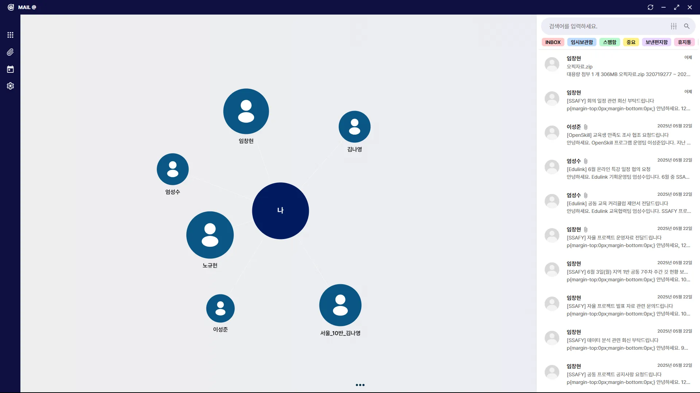

- 이메일 상세 정보와 본문을 확인할 수 있으며, 답장 및 전달 기능을 제공합니다.
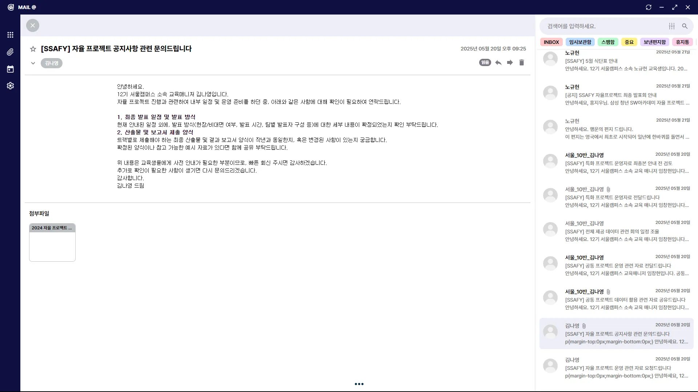
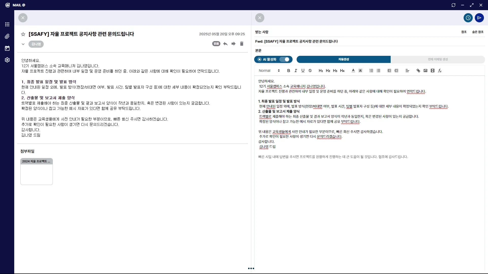

- 특정 메일과 주고받은 메일을 채팅 형태로 확인할 수 있습니다.
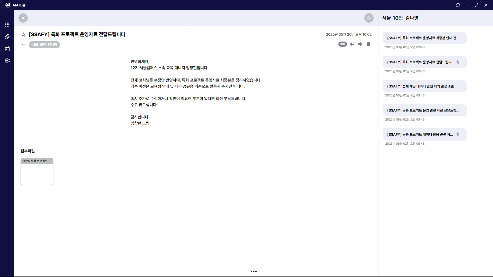

- AI가 접목된 새 메일 작성 기능을 통해 간편하게 메일을 작성하고 발송할 수 있습니다.
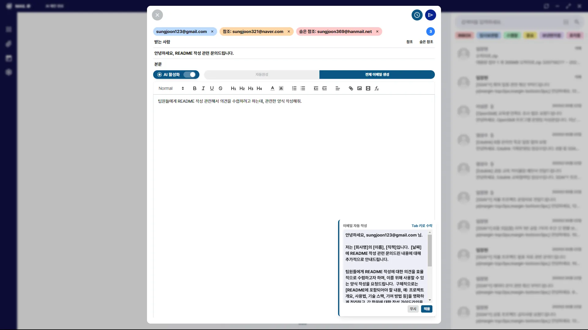

- 연동할 메일 계정을 설정할 수 있으며, IMAP/SMTP 프로토콜을 통해 메일 송수신을 처리합니다.
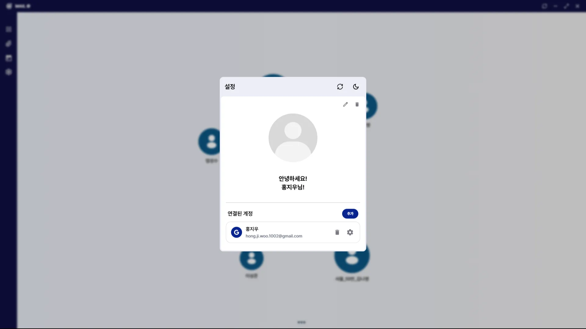
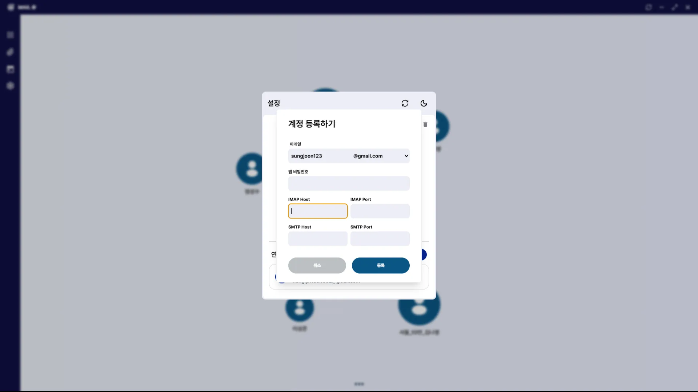

- 필요시 수동으로 메일 동기화가 가능합니다.
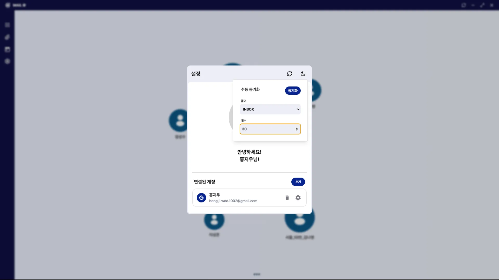

- 라이트 모드와 다크 모드를 지원하여 사용자 편의성을 높였습니다.
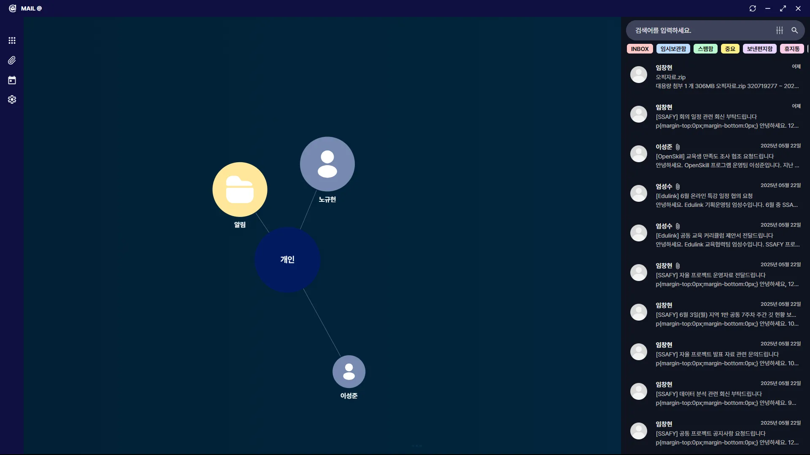
</details>

<br>

<details>
<summary><strong>관계 기반 이메일 네트워크 시각화 및 관리</strong></summary>
<br>

- 이메일 송수신 관계를 그래프로 표현하여 시각적으로 이해하기 쉽게 구성했습니다.
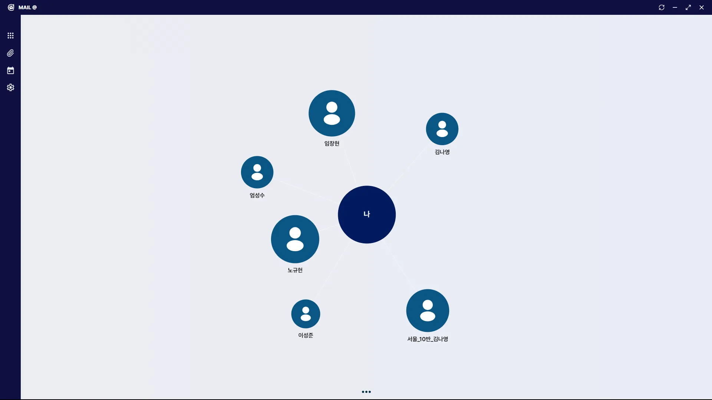

- 검색 및 필터링 기능을 통해 특정 이메일 주소나 도메인으로 관계를 쉽게 파악할 수 있습니다.
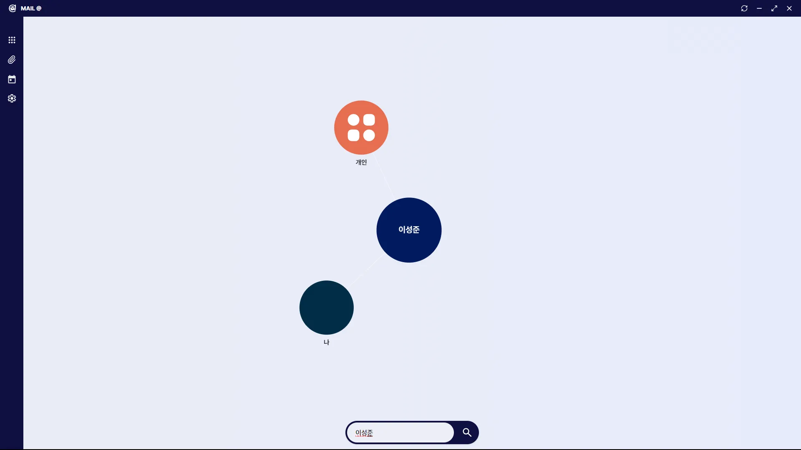

- 노드 클릭 시 해당 분류에 포함된 메일을 표시합니다.
- 드래그 앤 드롭으로 노드 위치 조정이 가능합니다.
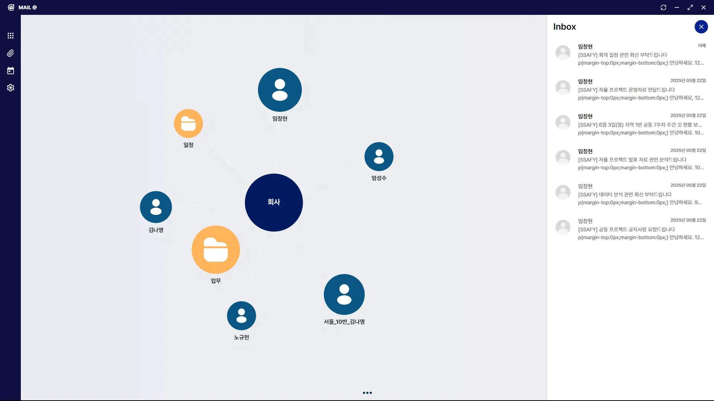
</details>

<br/>

<details>
<summary><strong>AI 기반 내용 자동 완성, 양식 추천 및 내용 검사</strong></summary>
<br>

- sLLM을 활용하여 작성 중인 메일의 내용을 자동으로 분석하고, 답장 양식 추천 기능을 제공합니다.
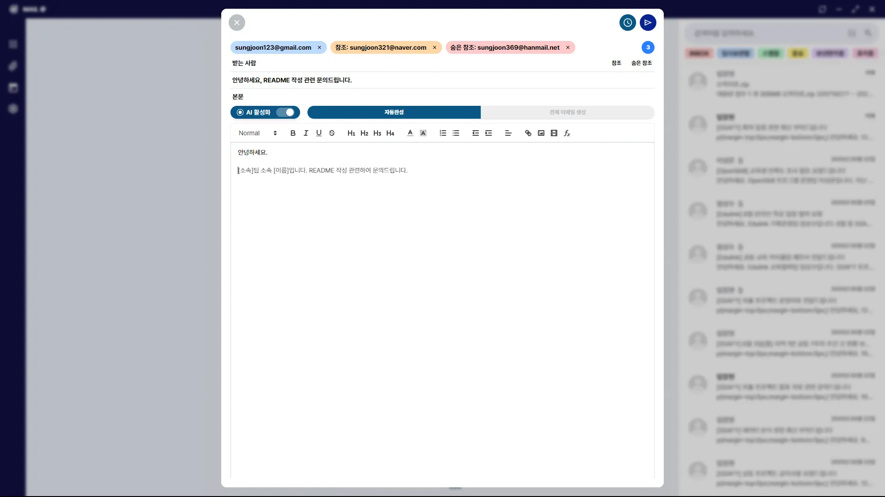

- sLLM을 활용하여 필요 시 답장 양식을 추천합니다.


- sLLM을 활용하여 작성 중인 메일의 내용을 자동으로 검사하고, 필요 시 수정 제안을 제공합니다.
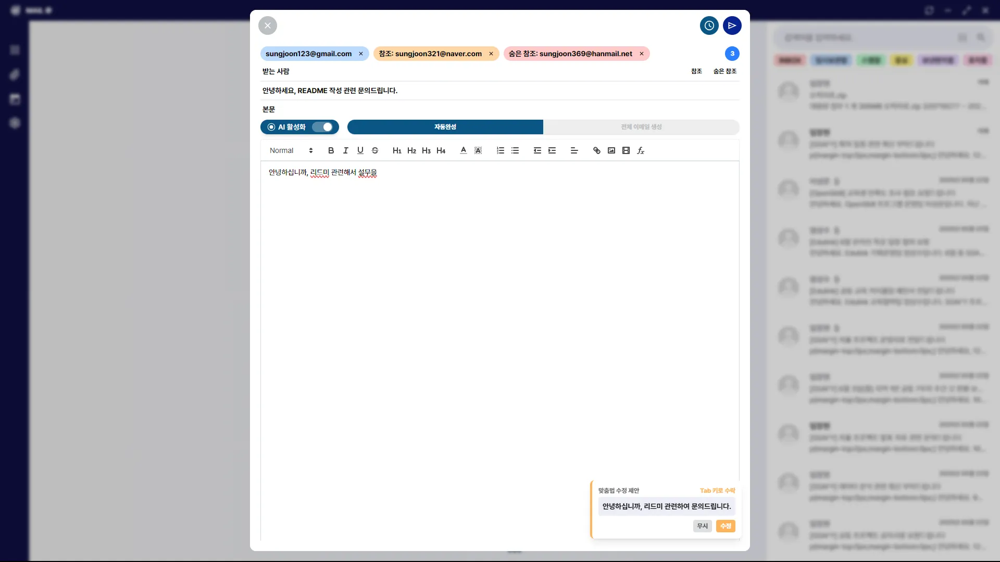
</details>

<br/>

<details>
<summary><strong>첨부파일 미리보기 및 로컬 저장 기능</strong></summary>
<br>

- 첨부파일 탭을 통해 그동안 수신한 메일의 첨부파일을 미리 볼 수 있습니다.
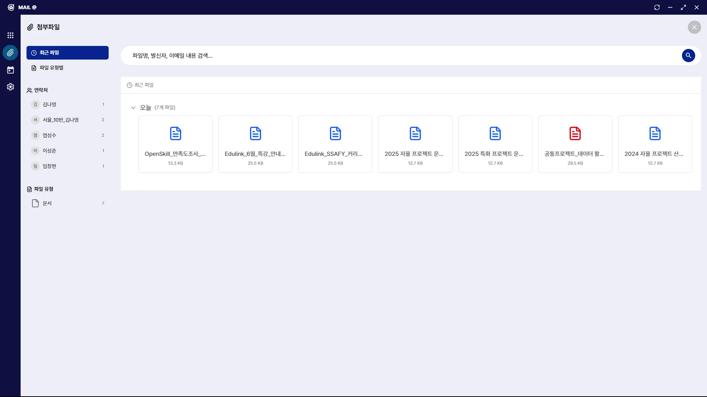

- 첨부파일을 클릭하면 미리보기 화면이 표시되며, 로컬 PC에 저장할 수 있는 기능을 제공합니다.
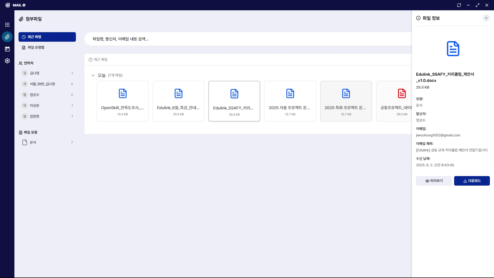
</details>

<br/>

<details>
<summary><strong>로컬 SQLite 데이터베이스를 이용한 안전한 메일 데이터 관리</strong></summary>
<br>

</details>

<br/>

<small>펼쳐보기 기능을 통해 각 기능의 상세 내용을 확인할 수 있습니다.</small>

<br/>
<br/>

## 3. 기술 스택

### **Electron Client (Renderer/Frontend)**
- **Language**: `TypeScript`, `JavaScript`
- **Framework**: `React (Vite)`, `Electron + React`
- **Routing**: `React Router`
- **Data Fetching**: `TanStack Query`
- **State Management**: `Zustand`
- **Styling**: `Tailwind CSS`
- **Editor**: `React Quill`
- **Graph Visualization**: `React Force Graph`
- **API Mocking**: `MSW (Mock Service Worker)`

### **Electron Client (Main/Backend)**
- **Language**: `JavaScript`
- **Runtime**: `Node.js`
- **Framework**: `Electron`
- **Database**: `SQLite3`
- **Mail Protocols**: `node-imap`, `nodemailer`

### **C++ Addon**
- **Language**: `C++17`
- **Binding**: `Node-API`
- **Build System**: `node-gyp`
- **Library**: `mailio` (네이티브 메일 프로토콜 처리)

### **sLLM Server**
- **Language**: `Python`
- **Framework**: `Flask`
- **AI/ML**: `Transformers (Hugging Face)`, `PyTorch`, `Llama-cpp-python`, `OpenAI API`

### **Development & Tools**
- `ESLint`, `Prettier`, `TypeScript`, `Electron Rebuild`

<br/>
<br/>

## 4. 프로젝트 구조

```
MAIL@/
│
├── apps/
│   ├── electron-client/  # Electron 데스크톱 애플리케이션
│   │   ├── addon/          # C++ 네이티브 애드온 (메일 프로토콜 처리)
│   │   ├── src/
│   │   │   ├── main/       # Electron 메인 프로세스 (백엔드 로직)
│   │   │   └── renderer/   # Electron 렌더러 프로세스 (React UI)
│   │   ├── public/         # 정적 에셋
│   │   ├── package.json
│   │   └── binding.gyp     # C++ 애드온 빌드 설정
│   │
│   ├── gemma-server/     # sLLM 서버 (Python, AI 기능)
│   │   ├── server.py       # Flask 기반 API 서버
│   │   ├── model_download.py # 모델 다운로드 스크립트
│   │   └── _requirements.txt # Python 의존성
│   │
│   └── web-site/         # 프로젝트 소개 웹사이트
│       ├── index.html
│       └── css/
│
├── exec/                 # 빌드 및 실행 관련 문서
│   ├── electronBuild.md
│   ├── sLLMserverBuild.md
│   └── distWebsite.md
│
├── package.json          # 최상위 프로젝트 관리
└── README.md             # 프로젝트 문서
```

<details>
<summary><strong>상세 프로젝트 구조 보기</strong></summary>
<br>

```
📦apps
 ┣ 📂electron-client
 ┃ ┣ 📂addon
 ┃ ┃ ┣ 📜addon.cpp
 ┃ ┃ ┣ 📜binding.gyp
 ┃ ┃ ┗ ... (C++ 소스 및 헤더 파일)
 ┃ ┣ 📂src
 ┃ ┃ ┣ 📂main
 ┃ ┃ ┃ ┣ 📂controllers
 ┃ ┃ ┃ ┣ 📂database
 ┃ ┃ ┃ ┣ 📂repositories
 ┃ ┃ ┃ ┣ 📂services
 ┃ ┃ ┃ ┗ ... (메인 프로세스 로직)
 ┃ ┃ ┗ 📂renderer
 ┃ ┃ ┃ ┣ 📂apis
 ┃ ┃ ┃ ┣ 📂assets
 ┃ ┃ ┃ ┣ 📂components
 ┃ ┃ ┃ ┣ 📂hooks
 ┃ ┃ ┃ ┣ 📂layouts
 ┃ ┃ ┃ ┣ 📂pages
 ┃ ┃ ┃ ┣ 📂stores
 ┃ ┃ ┃ ┗ ... (React UI 컴포넌트 및 로직)
 ┃ ┣ 📜main.js
 ┃ ┣ 📜preload.cjs
 ┃ ┣ 📜package.json
 ┃ ┗ 📜vite.config.ts
 ┣ 📂gemma-server
 ┃ ┣ 📜server.py
 ┃ ┣ 📜model_download.py
 ┃ ┗ 📜_requirements.txt
 ┣ 📂web-site
 ┃ ┣ 📜index.html
 ┃ ┗ 📜css/style.css
 ┗ 📜README.md
```

</details>

<br/>
<br/>

## 5. 포팅 메뉴얼

추후 업데이트 예정
<!-- **[Mail@ 포팅 매뉴얼](./exec/distWebsite.md)**  
**[일렉트론 포팅 매뉴얼](./exec/electronBuild.md)**  
**[sLLM Server 포팅 매뉴얼](./exec/sLLMserverBuild.md)** -->

<br/>
<br/>

## 6. 팀 소개

| 이름   | 역할 및 구현 기능                                                                                    |
| ------ | ---------------------------------------------------------------------------------------------------- |
| 임창현 | **Project Manager**<br>- C++ 네이티브 애드온 개발 및 빌드 시스템 구축|
| 이성준 | **Frontend**<br>- UI/UX 설계 및 이메일 네트워크 시각화 구현<br>- 핵심 페이지 및 컴포넌트 개발<br> - 프론트엔드 API 연동, 상태 관리 및 데이터 흐름 설계                    |
| 홍지우 | **Backend**<br>- 전체 프로젝트 빌드/배포 환경 구성<br>- Electron 메인 프로세스 아키텍처 설계<br>- 데이터베이스 스키마 설계 및 관리 (SQLite)       |
| 김나영 | **AI**<br>- 온디바이스 메일 파싱 및 전처리 로직 개발    |
| 노규헌 | **AI**<br>- sLLM 서버 개발 및 AI 모델(답장 추천, 요약) 연동<br>- AI 기능 API 설계 및 구현   |
| 엄성수 | **AI**<br>- 그래프 DB 설계 및 개발<br/>- 그래프 기반 데이터 API 설계 및 구현 |

